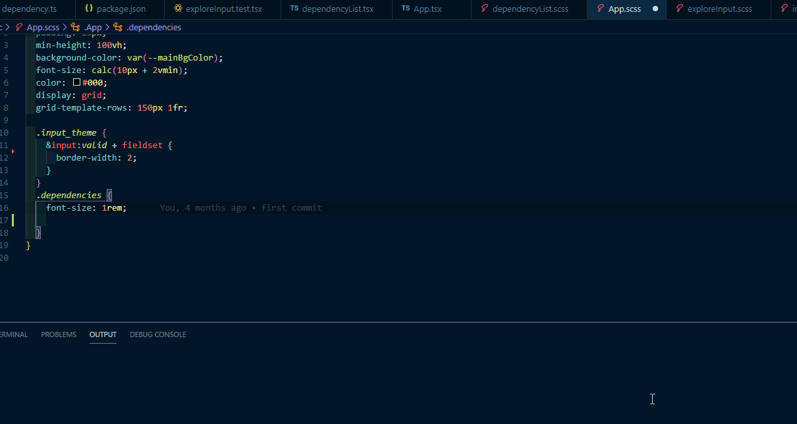

# css-var-hint

This extension enhances CSS variable hints in style files (CSS, SCSS, LESS, etc.) with the following features:

- **Hover Preview:** Shows the value of a CSS variable on hover, including a color swatch if the value is a color.
- **Source Linking:** Hover tooltips link directly to the variable's definition in the source file.
- **Panel View:** View all CSS variables in your workspace in a dedicated panel.
- **Improved Search:** Enhanced search engine for variable discovery.
- **On-the-fly Updates:** Variables update automatically when files are saved.
- **Force Scan:** Command to force a rescan of all CSS variables in the workspace.

- **Performance Note:** Uses a wildcard activation event for immediate availability.

